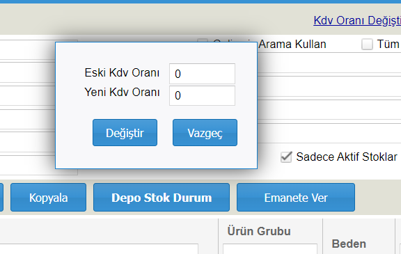

# Toplu Kdv Oranı Değiştirme

Stok kartlarındaki Kdv Oranlarını güncellemek için **Stok listesi** ekranına giriniz.

.png>)

Stok listesi ekranında kdv oranı değiştirilecek stokları listeleyiniz(Filtreleme seçeneklerinden filtreleme yaparak sadece bazı ürün gruplarının kdv'sini değiştire de bilirsiniz). Tüm stoklarda Kdv oranını değiştirmek için **Tüm Stoklar** seçeneğini işaretlemeyi unutmayınız.

.png>)

Daha sonra **Stok listesi** ekranın üst kısmında **KDV Oranı değiştir** linki bulunmaktadır. Bu linke tıklayarak kdv oranı değiştirme ekranını açabilirsiniz.

Kdv Oranı değiştirme ekranında stok listesi ekranında listelenen stoklara uygulanacak yeni kdv oranını yazıp **Değiştir** butonuna tıklamalısınız.

Böylece listelenen stokların kdv'leri yeni girdiğimiz kdv oranına göre değiştirilecektir.

